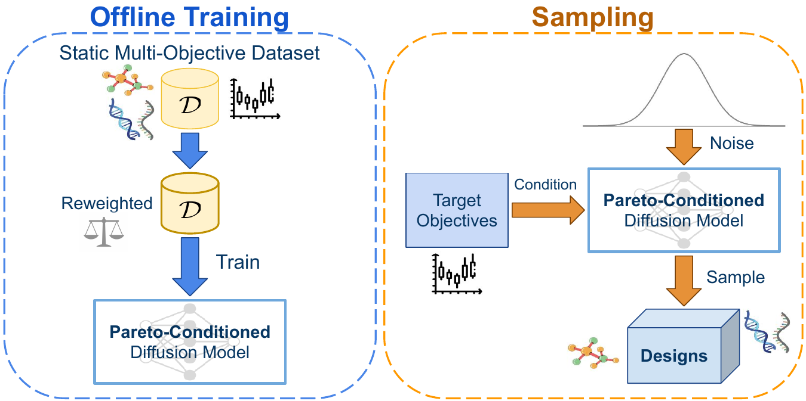
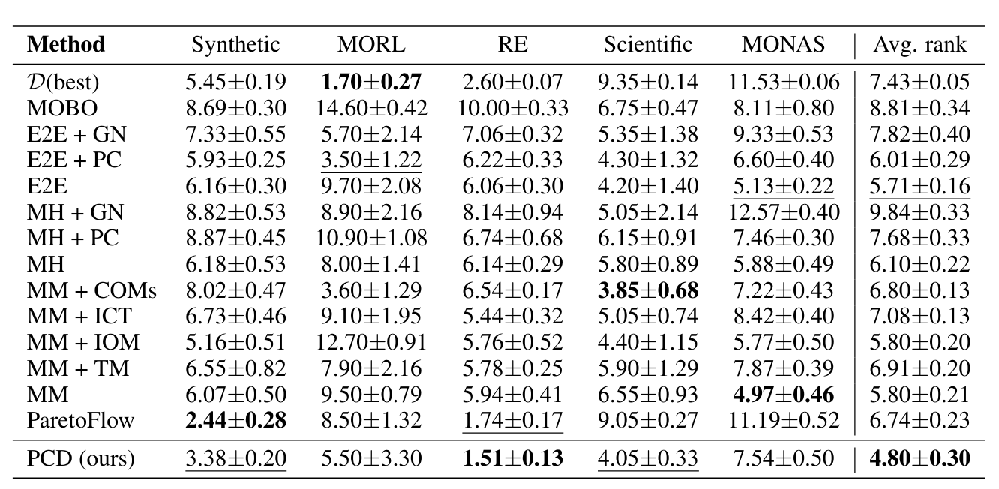

<div align="center"> <h2>Pareto-Conditioned Diffusion Models for<br>
	Offline Multi-Objective Optimization</h2></div>

### <div align="center"> ICLR 2026 (Oral) <div>

<div align="center">
  <a href="https://sites.google.com/view/pcd-iclr26/"></a> &ensp;
  <a href="https://arxiv.org/abs/2602.00737"></a> &ensp;
</div>

<p align="center" border-radius="10px">
  
</p>

This is the official PyTorch implementation of [Pareto-Conditioned Diffusion Models for Offline Multi-Objective Optimization](https://openreview.net/forum?id=S2Q00li155), presented at ICLR 2026. 

**Pareto-Conditioned Diffusion (PCD)** reframes offline multi-objective optimization as a conditional sampling problem.

- **Training**: Employs a novel reweighting strategy to emphasize high-quality solutions near the Pareto front.
- **Sampling**: Directly generates novel designs conditioned on target objectives, sidestepping the need for explicit surrogate models.

<p align="center" border-radius="10px">
    
</p>

**PCD** achieves highly competitive performance and demonstrates greater consistency across diverse tasks than existing approaches, using a single set of hyperparameters.

## Installation
This code base builds on top off [Offline-moo](https://github.com/lamba-bbo/offline-moo), 
and thus one needs to install it first. To make this process easier, the exact version
of offline-moo used in our case is included in `offline_moo/data`.

Begin the process by installing requirements for offline-moo 

```bash
cd offline_moo
conda env create -f environment.yml
conda activate off-moo
conda install gxx_linux-64 gcc_linux-64
conda install --channel=conda-forge libxcrypt

# Install requirements  from pip
conda install -r requirements.txt

conda install torch==2.0.1 torchvision==0.15.2 torchaudio==2.0.2 --index-url https://download.pytorch.org/whl/cu118

pip install scipy==1.10.1
pip install scikit-learn==0.21.3
pip install --upgrade pandas
pip install --upgrade kiwisolver

# Dependencies specific to our code  base
pip install gin-config==0.5.0
pip install einops==0.8.0
pip install torchdiffeq==0.2.5
pip install pygmo==2.19.5
pip install accelerate==1.0.1
pip install wandb==0.19.6
```

This should cover the basic installation. However, some of the tasks, such as scientific design
and MORL tasks require additional setup. For these we refer the reader to the official instructions
from [Offline-moo](https://github.com/lamda-bbo/offline-moo) 

- [Mujoco](https://github.com/lamda-bbo/offline-moo/tree/main#mujoco)
- [FoldX](https://github.com/lamda-bbo/offline-moo/tree/main#foldx)
- [MONAS](https://github.com/lamda-bbo/offline-moo/tree/main#evoxbench)


> [!CAUTION]
> Due to the complicated nature of the dependencies required by the different tasks in offline-moo,
> we found that it is easier to create separate environments for each subtask that requires
> additional software. Your mileage may vary!

After installing the required dependencies, download the offline data from [google-drive](https://drive.google.com/drive/folders/1SvU-p4Q5KAjPlHrDJ0VGiU2Te_v9g3rT) and place them in `offline_moo/data`.
(Note: experiments shown in the paper utilized the data_fix_250508 version of the dataset.)

## Reproducing results
Below are few examples to get you started 

Train & evaluate PCDiffusion in ZDT2. 
```bash
python train.py --task_name zdt2 --seed 1000 --domain synthetic --sampling-method 'reference-direction' --sampling-guidance-scale 2.5 --reweight-loss --experiment_name "reweight-ref-dir" --save-dir path/to/your_dir
```


Use data pruning instead of dataset reweighing in MORL
```bash
python train.py --task_name mo_hopper_v2 --seed 1000 --domain morl --sampling-method 'reference-direction' --sampling-guidance-scale 2.5 --data_pruning --experiment_name "pruning-ref-dir" --save-dir path/to/your_dir
```

Use simple condition mechanism without any data-processing (Ideal + N/A from table 2) in MONAS
```bash
python train.py --task_name c10mop2 --seed 2000 --domain monas --sampling-method 'uniform-ideal' --sampling-guidance-scale 2.5 --data_pruning --experiment_name "pruning-ref-dir" --save-dir path/to/your_dir
```

The results from the paper are performed for all tasks & with seeds 1000, 2000, 3000, 4000, 5000

## 📖 BibTeX
```
@inproceedings{
	shrestha2026paretoconditioned,
	title={Pareto-Conditioned Diffusion Models for Offline Multi-Objective Optimization},
	author={Jatan Shrestha and Santeri Heiskanen and Kari Hepola and Severi Rissanen and Pekka J{\"a}{\"a}skel{\"a}inen and Joni Pajarinen},
	booktitle={The Fourteenth International Conference on Learning Representations},
	year={2026},
	url={https://openreview.net/forum?id=S2Q00li155}
}
```
